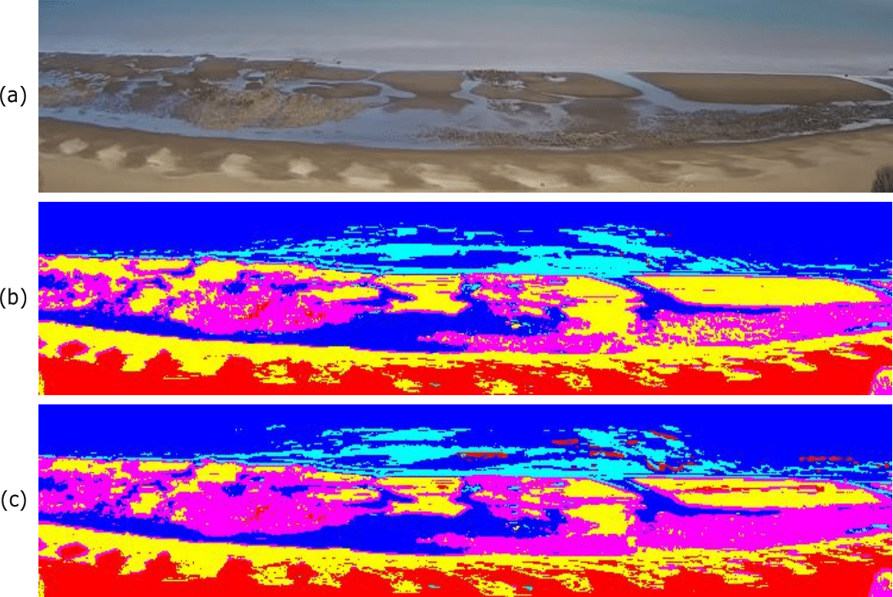

# Coastal-Monitoring
Procesamiento de imágenes costeras 

Beaches are highly dynamic environments, where complex modifications occur in a wide range of space-time scales. For this reason, and in order to study its dynamics and morphology, continuous monitoring is required. In the last decades, remote monitoring systems have proven to be an alternative for this and other similar purposes. In this work, classification methods were used using machine learning techniques, with videos taken from Pehuen-Có beach (Argentina). Different beach zones were automatically classified according to domain experts criteria, achieving an accuracy over 92 %.

